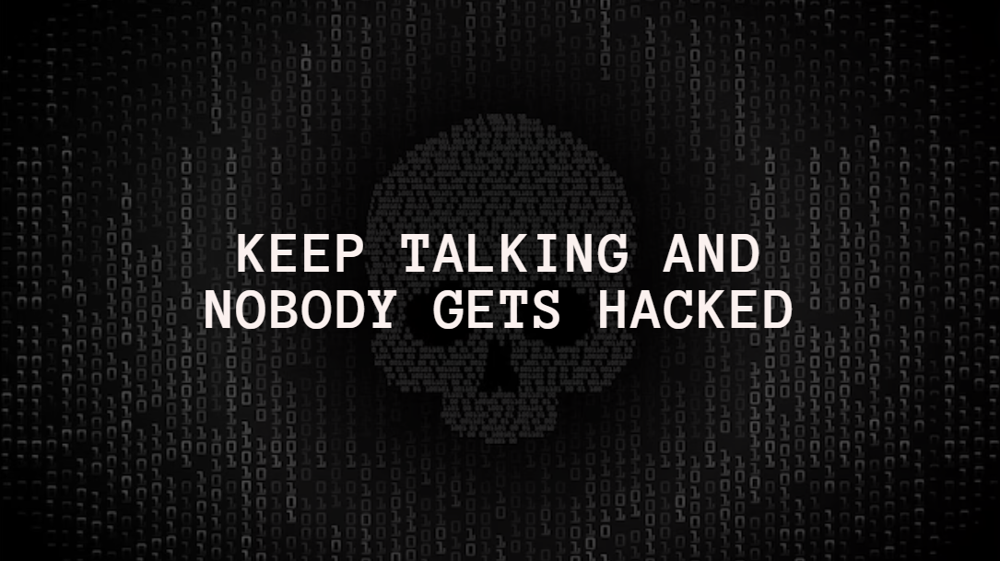

# Keep Talking and Nobody   Gets Hacked

## 📄 O Projeto

&nbsp;&nbsp;&nbsp;&nbsp;&nbsp;É um jogo colaborativo desenvolvido para o evento de recepção dos calouros de 2024 do Instituto de Tecnologia e Liderança - Inteli por membros dos clubes [Inteli GameLab](https://www.instagram.com/inteligamelab/) e [EchoSec](https://www.instagram.com/echo.sec/). O desenvolvimento teve como inspiração as dinâmicas de comunicação e trabalho em equipe de [Keep Talking and Nobody Explodes](https://keeptalkinggame.com), tanto que também foi construído um [Manual de Instrução](./InstructionManual/Manual%20de%20Instruções%20-%20Onboarding%202024.pdf) como parte essencial da *gameplay*.

## 💡 A Ideia

&nbsp;&nbsp;&nbsp;&nbsp;&nbsp;Com o objetivo de construir uma rápida dinâmica de integração entre os novos entrantes da faculdade, Keep Talking and Nobody Gets Hacked surgiu com a proposta de conciliar conhecimentos de jogos e de cibersegurança de forma lúdica, apresentando conceitos de ambas as áreas de maneira simplificada e interativa.

&nbsp;&nbsp;&nbsp;&nbsp;&nbsp;Além disso, considerou-se importante estimular a colaboração e a comunicação entre os calouros. Por isso, mesmo que não pudéssemos disponibilizar notebooks para todos simultaneamente durante o evento, gostaríamos de desenvolver um jogo digital que todos pudessem jogar de forma colaborativa. Dessa forma, a adaptação a um modelo de jogo com um manual de instrução e jogado em duplas foi a solução que encontramos para realizar a dinâmica da melhor forma possível! 

## 👾 O Jogo

&nbsp;&nbsp;&nbsp;&nbsp;&nbsp;Keep Talking and Nobody Gets Hacked é um *typing game* (jogo baseado em digitação) no qual o jogador precisa se livrar de um hacker e alguns arquivos maliciosos que ele instala no seu computador. Para isso, ele conta com um manual de remoção de ameaças cibernéticas, o terminal do WindowsXP e comandos essenciais. Entretanto, é claro que o hacker não facilita em nada esse processo, e se demorar mais de dez minutos para remover as ameaças, o jogador perde o controle de sua máquina e é derrotado na batalha digital. Por fim, sendo um *typing game*, a digitação correta dos comandos também é muito importante, e erros dão vantagem de tempo ao hacker.